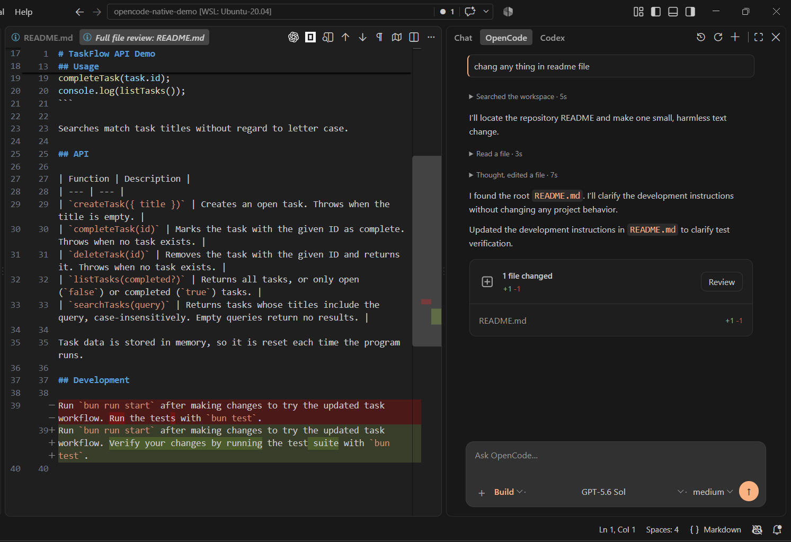
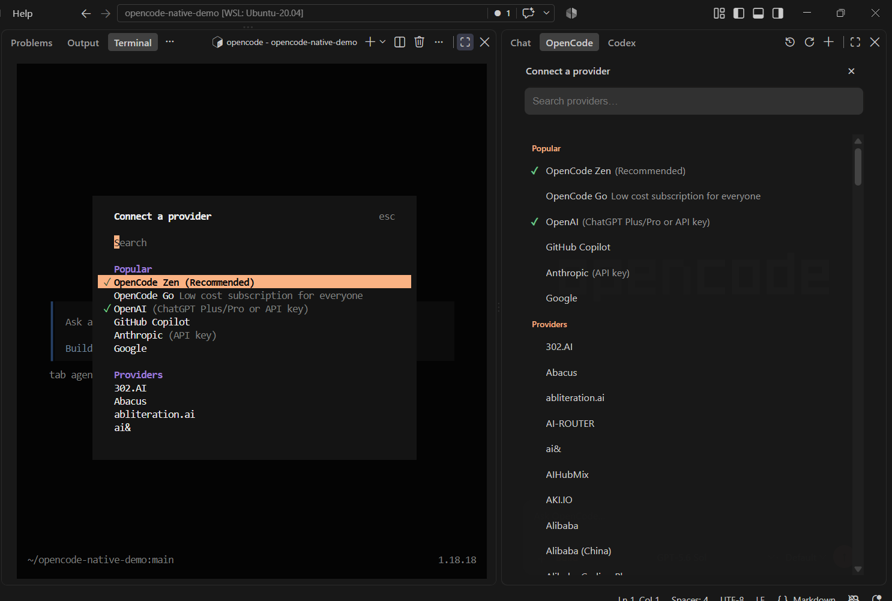
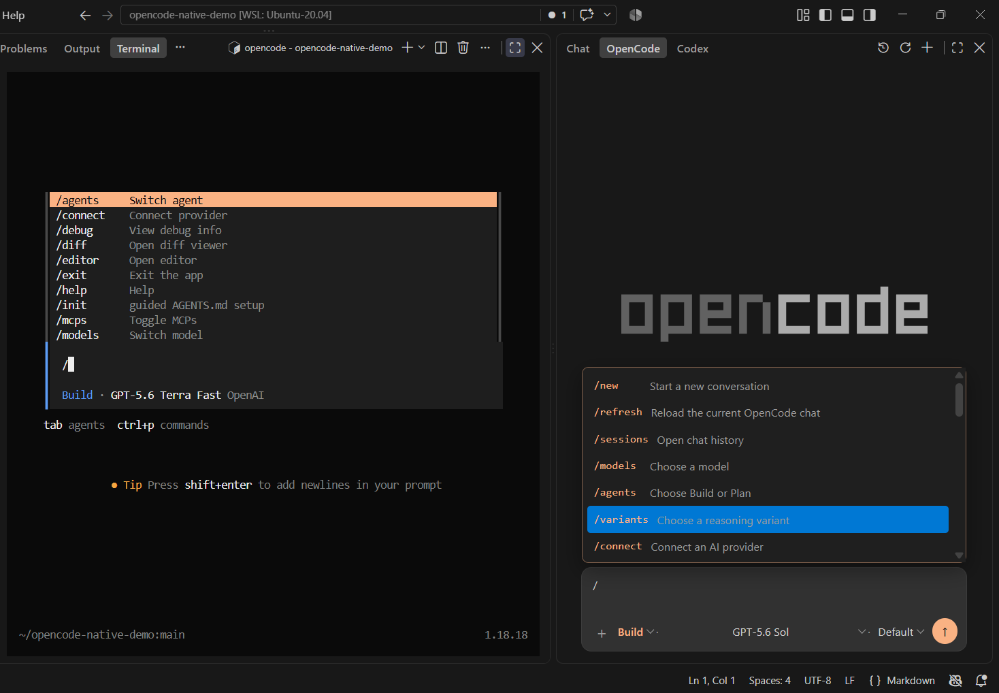
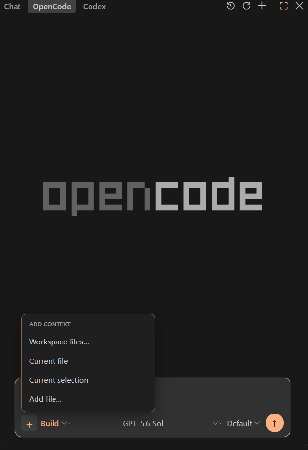
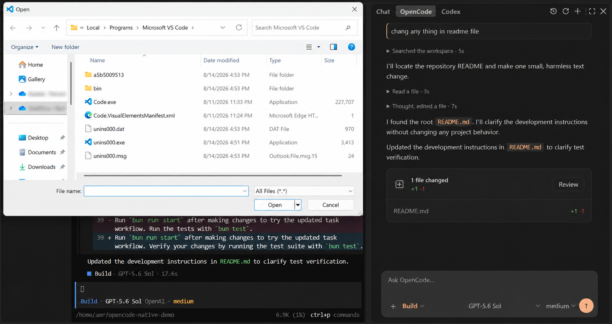
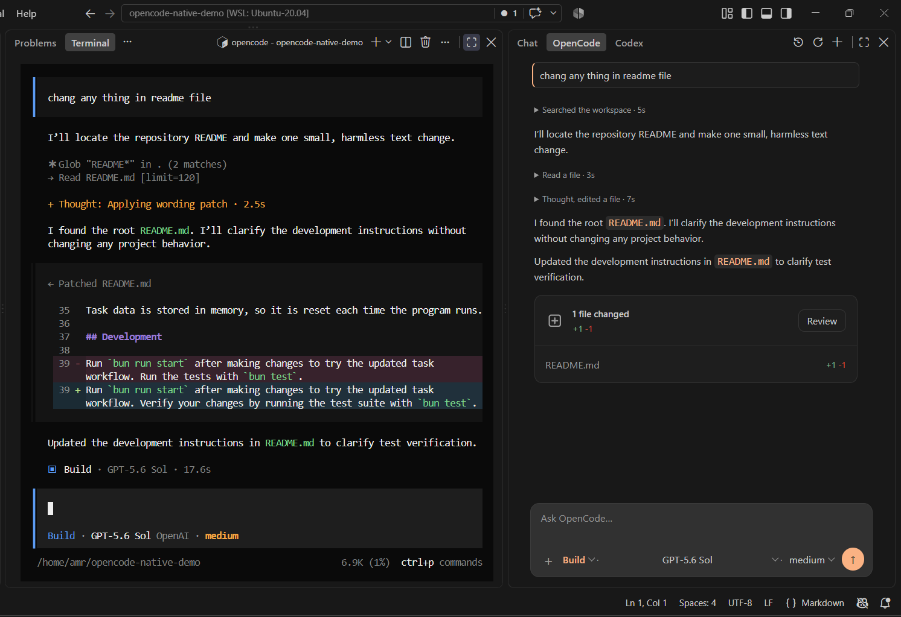

# OpenCode Native

Use OpenCode from a native VS Code sidebar while keeping the OpenCode CLI, providers, configuration, and sessions underneath.

> [!IMPORTANT]
> OpenCode Native is an independent community extension. It is not affiliated with, endorsed by, or maintained by the OpenCode team.



[Watch the 23-second demo](https://github.com/amr-elzoghby/OpenCode-Native/blob/main/media/opencode-native-demo.mp4)

## Highlights

- Streaming chat with OpenCode models, agents, variants, questions, and tool activity.
- Current-context and full-session usage, plus expandable model, timing, cost, and token details for each turn.
- Searchable session history with rename, delete, refresh, fork, undo/redo, rolled-back message restore, and native diff review.
- Provider sign-in through `/connect`, including subscription/OAuth and API-key methods exposed by OpenCode.
- Workspace context plus local text, PDF, image, audio, and video attachments.
- Searchable slash commands, current OpenCode commands and skills, MCP controls, and RTL-aware rendering.
- Approval UI only when OpenCode emits a real pending permission request.

<p align="center">
  
  
</p>

## Usage and message history

The context meter beside the model uses usage reported by OpenCode. Hover or focus it for a quick summary, or open it for current-context and full-session token and cost details. A response footer shows the model, agent, timing, and exact turn usage when available. Cost is an OpenCode estimate, not a provider invoice.

After undoing one or more turns, a collapsed **Rolled-back messages** dock appears above the composer. Expand it to restore a specific prompt through OpenCode's official session history—without keeping a second copy of the conversation in the extension.

## Install and set up

1. Install **OpenCode Native** from the [Visual Studio Marketplace](https://marketplace.visualstudio.com/items?itemName=amr-elzoghby.opencode-native), or search for `OpenCode Native` in the VS Code Extensions view.
2. Install the [OpenCode CLI](https://opencode.ai) where the VS Code Extension Host runs. In WSL, SSH, or a dev container, install it inside that environment.
3. If `opencode` is not on `PATH`, open Settings, search for **OpenCode Native: Executable Path**, and enter its absolute path in that environment.
4. Run **Developer: Reload Window** after changing the executable path.

Open a trusted, filesystem-backed project, then open **OpenCode** in the Secondary Sidebar. Use `/connect` to sign in, or reuse a provider already connected in the same OpenCode environment.

## Files and context

Use the `+` menu to add workspace files, the current file, the current selection, or **Add file...**.

<p align="center">
  
</p>

**Add file...** opens the device file picker and adds one file at a time. The picker displays all files, but Native accepts only supported UTF-8 text extensions, PDF, PNG/JPEG/GIF/WebP, and recognized audio/video formats. The selected model must support non-text input.



Per-file limits: 256 KiB for text, 5 MiB for images, and 25 MiB for PDF, audio, or video; attachment-count and total-size caps also apply. Workspace context is restricted to regular, non-symlink files inside the current workspace.

## Shortcuts

| Shortcut | Action |
| --- | --- |
| `Alt+N` | New chat |
| `Alt+R` | Refresh the Native chat |
| `Alt+H` | History |
| `Alt+M` | Models |
| `Alt+A` | Agents |
| `Escape` | Stop an active response |

The `Alt` shortcuts work while keyboard focus is anywhere inside the OpenCode sidebar—click inside it first. `Escape` works while the composer is focused and a response is active.

Use `Cmd+Esc` on macOS or `Ctrl+Esc` on Windows/Linux to open or focus the OpenCode TUI. Add `Shift` to start another TUI terminal. The launcher uses the same configured executable.

## Slash commands

Type `/` to open the command list and keep typing—for example, `/s`—to filter it. Use `/help` for the supported Native actions.

Common actions include `/connect`, `/sessions`, `/new`, `/refresh`, `/models`, `/agents`, `/variants`, `/mcps`, `/compact`, `/fork`, `/undo`, `/redo`, and `/diff`. Current OpenCode commands, MCP commands, and skills also appear. TUI-only or conditional actions are labeled unavailable in Native instead of being run incorrectly; unknown slash text is sent as an ordinary prompt.

## Native and TUI sessions

Native and the TUI can reuse stored sessions and provider sign-in when they run in the same OpenCode data environment and project folder. Two already-open clients do not update each other live.

- TUI to Native: wait for the response to finish, open the same session, then use **Refresh**, `Alt+R`, or `/refresh` in Native.
- Native to TUI: reopen or resume the session in the TUI. `/refresh` is Native-only.

Avoid writing to the same session from both clients at the same time.



## Security and limits

- The Extension Host owns the authenticated loopback OpenCode server. Provider credentials and the server password are not exposed to the Webview.
- `/connect` sends credentials from VS Code host inputs to OpenCode Core; the sidebar never receives those secrets.
- After explicit selection, the Webview reads the device file and sends its basename, MIME hint, and bounded content to the Extension Host; the full local path is not sent. The host revalidates the payload, detects an allowed type, and checks size and model support before submission.
- Native does not decide which actions require approval. It shows only real pending requests from OpenCode Core and returns **Allow once** or **Deny**. Routine reads, searches, directory inspection, and informational commands remain silent whenever Core allows them; Native has no command-name risk engine.
- Native Review depends on valid OpenCode snapshot/diff data. Edits can still finish when review data is unavailable.
- Live cross-client sync and persistent **Always Allow** management are not included in this release.

## Development

Clone this repository, open its root in VS Code, and install dependencies:

```sh
bun install
```

Then press `F5`. The included launch task builds the extension and starts an Extension Development Host.

```sh
bun run check-types
bun test src/test
bun run lint
bun run package
```

## Issues and license

Report bugs at [GitHub Issues](https://github.com/amr-elzoghby/OpenCode-Native/issues).

OpenCode Native is distributed under the [MIT License](LICENSE); dependency notices are in [THIRD_PARTY_NOTICES.md](THIRD_PARTY_NOTICES.md). OpenCode is a separate MIT-licensed project.
